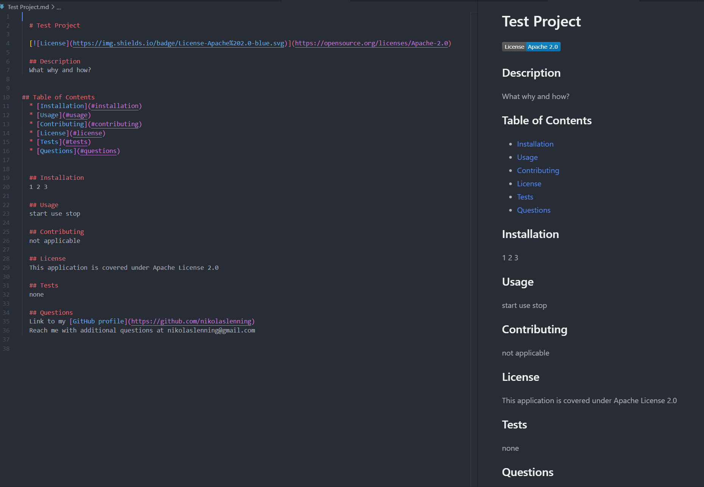

# readme-generator


## Description
Readme Generator is a command-line application that dynamically generates a professional README.md from a user's input. The motivation behind creating this application was to accelerate and simplify the process of creating a quality readme for any future applications. The purpose of this application is to allow more time to be spent working on a project, rather than spending time creating a exceptional readme.

## Installation
The steps required to install this application are as follows:
 1. Depending on user, open either the Command Prompt, PowerShell, or Terminal. 
 2. Go to the command line and navigate to the appropriate folder houseing the readme generator program. 
 3. Run the command line program by typing "node index.js" and pressing Enter
 4. Follow the prompts and questions to generate a readme using the information provided. 

## Usage
The application will be invoked with the following command:
```
node index.js
```


[Link to video](https://drive.google.com/file/d/1lGcxqsqG1YO_5cMMg8urbuE1bYGmZVXB/view) demostrating the user flow through the command-line application demostrated above.


Screenshot demostrating the readme generated from the information provided in the demostration GIF.

[Sample Readme.md file](test.md) generated from in the demonstration.

## Credits
[Inquirer Package](https://www.npmjs.com/package/inquirer) was used to ask the user questions, take that input, and dynamically create a readme based on user answers. 

A live link to my [Readme Generator](https://nikolaslenning.github.io/readme-generator/) is hosted on Github pages.

This application was authored by [Nikolas Lenning](https://github.com/nikolaslenning).

